# Autonomous Driving System Testing with Domain Augmentation

This repository provides **domain augmentation** techniques for **Autonomous Driving System (ADS) testing**. By integrating diffusion-model-based methods (Instruction-editing, Inpainting, and Inpainting with Refinement) into a **physics-based simulator**, our approach uncovers ADS failures that standard simulations might overlook.

<p align="center">
  
  
</p>

## Table of Contents
- [Requirements](#requirements)
- [Installation and Usage](#installation-and-usage)
- [Project Structure](#project-structure)
- [Augmented Datasets](#augmented-datasets)
  - [Instruction-editing](#instruction-editing)
  - [Inpainting](#inpainting)
  - [Inpainting-with-Refinement](#inpainting-with-refinement)
- [Human Study](#human-study)
- [Citation and License](#citation-and-license)

---

## Installation and Usage

1. **Clone this repository**:
   ```bash
   git clone https://github.com/deib-polimi/online-testing-augmented-simulator
   cd online-testing-augmented-simulator
    ```

## Requirements
To set up and run this project, ensure you have the following:

- **Python 3.8+**: The project is built on Python, so make sure you have the correct version installed. Experiments were executed with Python3.10.
- **CUDA-compatible GPU**: Essential for running the deep learning models efficiently. Experiments were executed with CUDA 12.1.
- **Required Python packages**: Install the dependencies using the following command:

  ```bash
  pip install -r requirements.txt
  ```
- Experiments were run on Linux Ubuntu 24.04.
  
## Project Structure

```
.
├── carla/                             # Domain Augmentation for CARLA
│   ├── ...   
├── data/                              # Dataset management
├── domains/                           # List of domains
│   ├── ...     
├── documentation/                     # Documentation of the human study
│   ├── ...
├── models/                            # Deep Learning models
│   ├── augmentation/                  # Diffusion models for augmentation
│   │   └── ...
│   ├── cyclegan/                      # CycleGAN distilled model
│   │   └── ...
│   ├── segmentation/                  # Pretrained models for semantic segmentation (not used)
│   │   └── ...                        # UNet used in the paper is at udacity-gym
│   └── vae/                           # Variational Autoencoder to measure domain distance
│       └── ...                        
├── requirements.txt                   # Python dependencies
├── scripts/                           # Code used to run experiments
│   ├── human_study/                   # Code used to execute the human study
│   │   └── ...
│   ├── iqa/                           # Code to run image quality assessment (not used)
│   │   └── ...
│   ├── offline/                       # Code for offline testing
│   │   └── ...                        
│   ├── online/                        # Code for online testing
│   │   └── ...                        
│   ├── ood/                           # Code for Out Of Distribution analysis
│   │   └── ...
│   ├── semantic/                      # Code for segmentation with pretrained models
│   │   └── ...                        
│   └── timing/                        # Code to evaluate how much time a trasformation take
│       └── ...                        
└── interfuser_agent.py                # Run the interfuser agent

```


## Udacity Simulator
We utilized the Udacity Self-Driving Car Simulator as the simulation environment for this project. 
The simulator supports various weather conditions, times of day, and road types, making it ideal for testing Autonomous Driving Systems (ADS) under different Operational Design Domains (ODDs).

- Download the simulator from this [link](https://icse-2025.s3.eu-north-1.amazonaws.com/udacity-linux.tar.xz).

## CARLA Simulator
We also used the open-source [CARLA](https://carla.org/) simulator to evaluate our approach under more complex, urban-like driving conditions. Built on Unreal Engine, CARLA provides advanced features such as realistic city layouts, pedestrian and vehicle traffic, diverse sensor suites (RGB cameras, LiDAR, radar), and configurable weather or time-of-day settings. These capabilities allow for more detailed testing of ADS behavior, including traffic signal compliance, overtaking maneuvers, and multi-agent interactions.

Experiments with CARLA were run using version 0.9.10.1, with a similar workflow to the Udacity simulator tests. The physics realism and dynamic traffic scenarios in CARLA can reveal additional edge-case failures not easily reproduced in simpler track-based simulators.

Please follow the instruction from the [Interfuser](https://github.com/opendilab/InterFuser) project:
```
chmod +x setup_carla.sh
./setup_carla.sh
easy_install carla/PythonAPI/carla/dist/carla-0.9.10-py3.7-linux-x86_64.egg
```


## Augmented Datasets

The dataset used in this project consists of image pairs generated from multiple ODD domains. 

We augmented the images collected from the Udacity simulator using three domain augmentation techniques and applied them to create new training and testing scenarios.

### Instruction-editing
Given an initial image and a text instruction (e.g., “change season to autumn”), this approach edits the scene accordingly.

The augmented dataset can be accessed from this [link](https://icse-2025.s3.eu-north-1.amazonaws.com/instructpix2pix.tar.xz)

**Prompt**: "Change season to autumn"
<p align="center">
  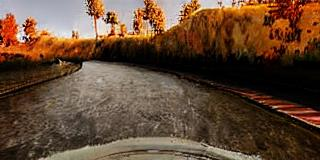
  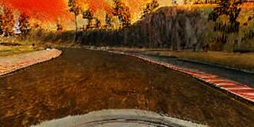 
  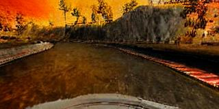
  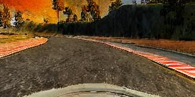 
  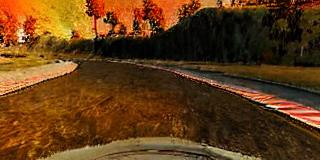
</p>

**Prompt**: "Change time to night"
<p align="center">
  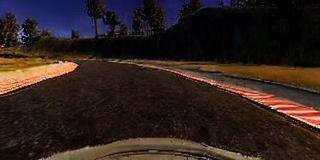
  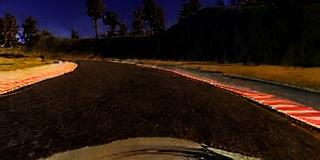 
  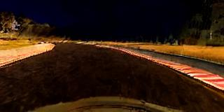
  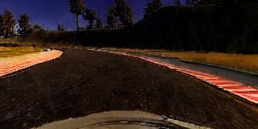 
  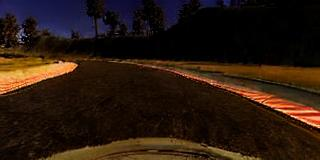
</p>


### Inpainting
Preserves the road pixels via a mask and regenerates the background with a text prompt.

The augmented dataset can be accessed from this [link](https://icse-2025.s3.eu-north-1.amazonaws.com/stable_diffusion_inpainting.tar.xz)

**Prompt**: "A street in autumn season"
<p align="center">
  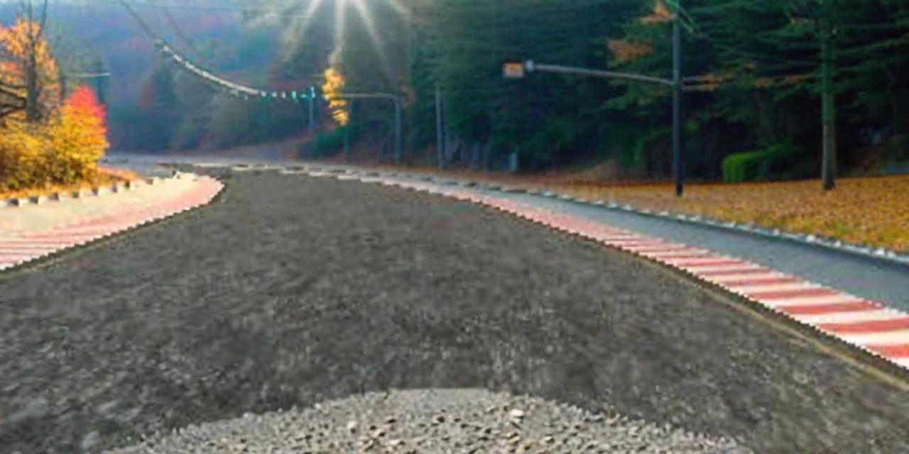
  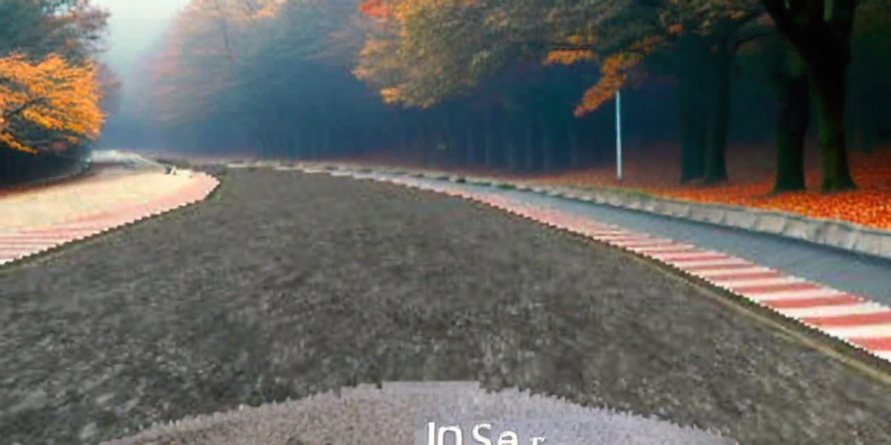
  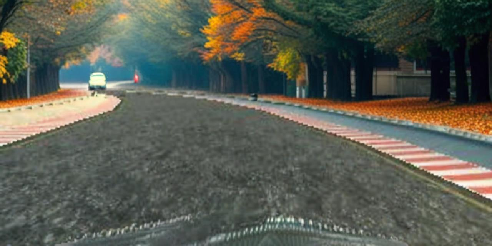
  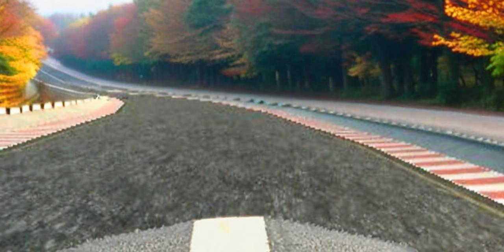
  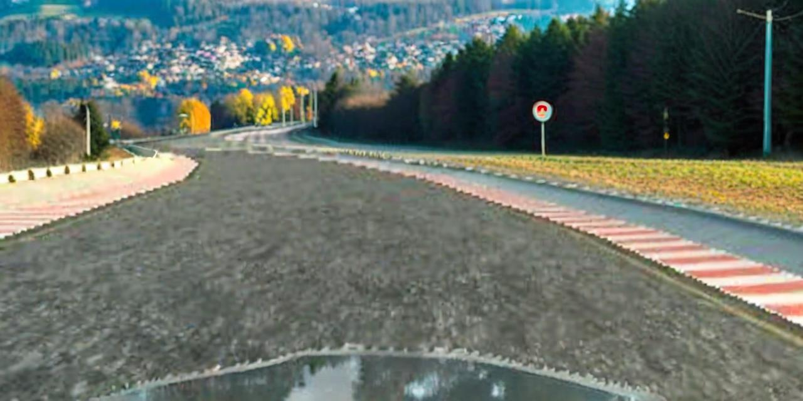
</p>

**Prompt**: "A street in night time"
<p align="center">
  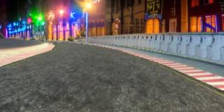
  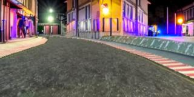
  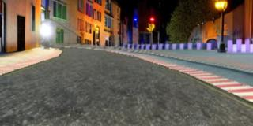
  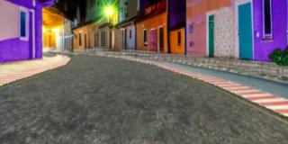
  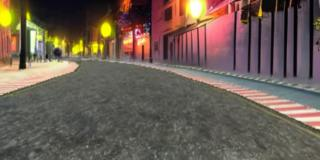
</p>

**Prompt**: "A street during dust storm"
<p align="center">
  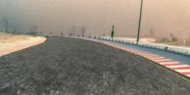
  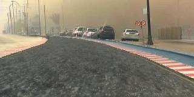
  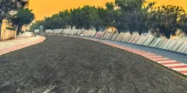
  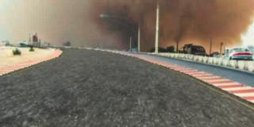
  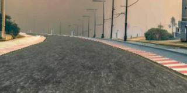
</p>

### Inpainting with Refinement
An additional refinement step enforces edge coherence for higher realism while retaining road geometry.

The augmented dataset can be accessed from this [link](https://icse-2025.s3.eu-north-1.amazonaws.com/stable_diffusion_inpainting_controlnet_refining.tar.xz)

**Prompt**: "A street in autumn season"
<p align="center">
  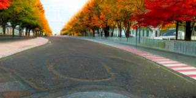
  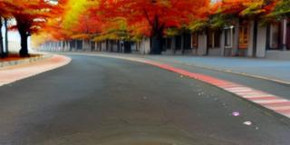
  
  
  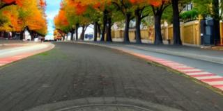
</p>

**Prompt**: "A street during dust storm"
<p align="center">
  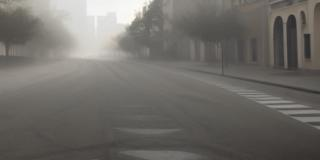
  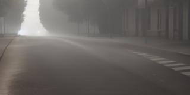
  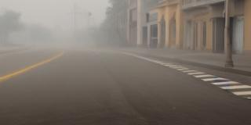
  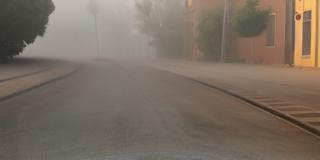
  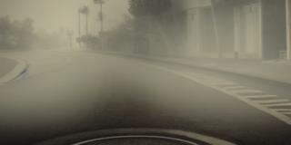
</p>

## Human Study

The human study and the documentation about its results can be found [here](documentation/human_study.md)

<p align="center">
  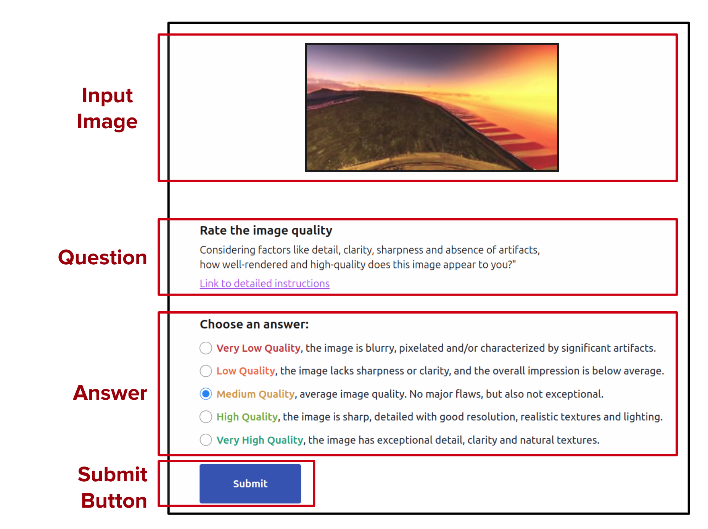
  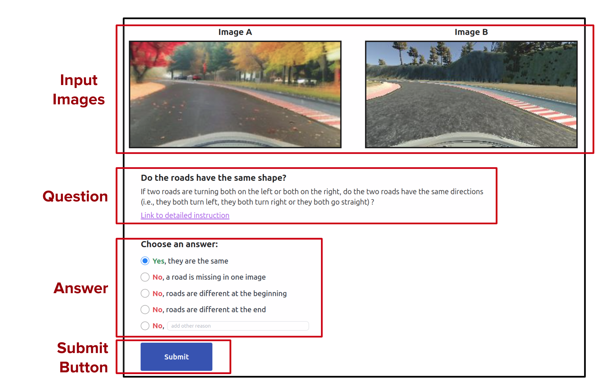
</p>

## Citation
```
@article{DBLP:conf/icse/augmented_online_testing_25,
  author       = {Luciano Baresi and
                  Davide Yi Xian Hu and
                  Andrea Stocco and
                  Paolo Tonella},
  title        = {Efficient Domain Augmentation for Autonomous Driving Testing Using
                  Diffusion Models},
  booktitle    = {Proceedings of the International Conference on Software Engineering},
  year         = {2025},  
}
```