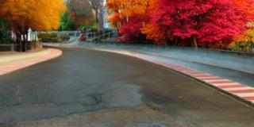

# Autonomous Driving System Testing with Domain Augmentation

[//]: # (<p align="center">)

[//]: # (  )

[//]: # (</p>)

## Requirements
To set up and run this project, ensure you have the following:

- **Python 3.8+**: The project is built on Python, so make sure you have the correct version installed. Experiments were executed with Python3.10
- **CUDA-compatible GPU**: Essential for running the deep learning models efficiently. Experiments were executed with CUDA 12.1
- **Required Python packages**: Install the dependencies using the following command:

  ```bash
  pip install -r requirements.txt
  ```
  
## Udacity Simulator
We utilized the Udacity Self-Driving Car Simulator as the simulation environment for this project. 
The simulator supports various weather conditions, times of day, and road types, making it ideal for testing Autonomous Driving Systems (ADS) under different Operational Design Domains (ODDs).
The experiments were run on Linux. 

- Download the simulator from this [link](https://icse-2025.s3.eu-north-1.amazonaws.com/udacity-linux.tar.xz).

## Augmented Datasets

The dataset used in this project consists of image pairs generated from multiple ODD domains. 

We augmented the images collected from the Udacity simulator using three domain augmentation techniques and applied them to create new training and testing scenarios.

### Instruction-editing
<p align="center">
  
   
  
   
  
</p>

The augmented dataset can be accessed from this [link](https://icse-2025.s3.eu-north-1.amazonaws.com/instructpix2pix.tar.xz)

### Inpainting
<p align="center">
  
  
  
  
  
</p>

The augmented dataset can be accessed from this [link](https://icse-2025.s3.eu-north-1.amazonaws.com/stable_diffusion_inpainting.tar.xz)

### Inpainting with Refinement
<p align="center">
  
  
  
  
  
</p>

The augmented dataset can be accessed from this [link](https://icse-2025.s3.eu-north-1.amazonaws.com/stable_diffusion_inpainting_controlnet_refining.tar.xz)

## Human Study

The human study and the documentation about its results can be found [here](documentation/human_study.md)

<p align="center">
  
  
</p>
