# Autonomous Driving System Testing with Domain Augmentation

This repository addresses the limited operational design domain (ODD) coverage in current autonomous driving simulators by integrating generative artificial intelligence techniques with physics-based simulation. Specifically, we implement three diffusion-based strategies—Instruction-editing, Inpainting, and Inpainting with Refinement—to produce augmented images representing new ODDs. An automated segmentation-based validator ensures semantic realism and achieved as low as 3% false positives in our human study, preserving image quality and correctness. System-level experiments showed that these domain augmentation methods increase ODD coverage, effectively uncovering previously undetected ADS failures before real-world testing.

<p align="center">
  
  
</p>

## Table of Contents
- [Purpose](#purpose)
- [Provenance](#provenance)
- [Data](#data)
- [Setup](#setup)
- [Usage](#usage)

## Purpose
This artifact provides **domain augmentation** techniques for **Autonomous Driving System (ADS) testing**, using three diffusion-based methods (Instruction-editing, Inpainting, and Inpainting with Refinement). These methods generate augmented driving images of diverse operational design domain (ODD) conditions (e.g., weather, time of day) while preserving the road structure. The artifact facilitates **system-level ADS testing** in both Udacity and CARLA simulators, allowing researchers to uncover failures that standard simulator setups might miss.

### ICSE Artifact Track Badges 

We are submitting this artifact for three ACM Artifact Badges: **Available**, **Functional**, and **Reusable**. We believe our artifact merits the **Available** badge because the code, documentation, and data are deposited in a publicly accessible and citable repository, ensuring long-term accessibility. We claim the **Functional** badge as the artifact is rigorously documented, consistent with the paper, and includes scripts and instructions that allow users to systematically reproduce our main findings. Finally, we contend that the artifact also qualifies for the **Reusable** badge by virtue of its well-structured codebase, detailed environment setup guides, and clearly defined extension points—facilitating future research and repurposing beyond the original study.

## Provenance
This artifact is publicly available in the following online repository:

- **GitHub Repository**: [https://github.com/deib-polimi/online-testing-augmented-simulator](https://github.com/deib-polimi/online-testing-augmented-simulator)

The **preprint** of the paper is available here:

- **Paper Preprint**: [Arxiv](https://arxiv.org/abs/2409.13661)

## Data

This artifact includes **nontrivial datasets** generated from virtual driving simulations, as well as augmented images created using diffusion-based methods. Below, we outline key aspects of data usage and management:

**Context:**  
Our datasets contain synthetic driving images depicting diverse Operational Design Domain (ODD) conditions (e.g., weather, time of day). These images are exclusively generated from physics-based simulators (Udacity and CARLA), ensuring no personally identifiable information is present.

**Data Provenance:**  
1. **Simulator Outputs:** The base images come from the Udacity Self-Driving Car Simulator and the CARLA simulator (version [PLACEHOLDER]).
2. **Augmented Images:** We applied diffusion-based augmentation (Instruction-editing, Inpainting, and Inpainting with Refinement) to produce new or modified variants of the simulator outputs.  
   - Each augmented dataset is distributed in compressed archives (e.g., `.tar.xz`) hosted on a public repository or archival service.  
   - See [Augmented Datasets](#augmented-datasets) for more details and direct download links.

**Ethical and Legal Statements:**  
- **Privacy:** Since all images are synthetic and do not involve real human subjects, there are no privacy concerns or personally identifiable data.  
- **Licensing:** Datasets are released under MIT LICENSE, or follow the standard license provided by the simulator.
- **Usage Permissions:** Ensure compliance with the simulator’s terms of service if you plan to distribute or reuse the base simulator outputs.  

**Storage Requirements:**  
- **Data Size:** Each augmented dataset may range from 7 GB to 10 GB, depending on the number of scenarios and image resolution.  
- **Disk Space:** Users should have sufficient storage (e.g., an additional 50GB) if all datasets are downloaded and expanded simultaneously.

> **Note**: Users must verify they have adequate **Storage** if employing these datasets for deep learning tasks or further augmentation. All datasets are compressed as 'tar.xz' files. Overall, we recommend to have 200 GB.

### Augmented Datasets

The dataset used in this project consists of image pairs generated from multiple ODD domains. 

We augmented the images collected from the Udacity simulator using three domain augmentation techniques and applied them to create new training and testing scenarios.

#### Instruction-editing
Given an initial image and a text instruction (e.g., “change season to autumn”), this approach edits the scene accordingly.

The augmented dataset (7.0 GB compressed) can be accessed from this [link](https://icse-2025.s3.eu-north-1.amazonaws.com/instructpix2pix.tar.xz)

> **Prompt**: "Change season to autumn"
<p align="center">
  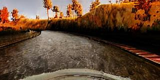
  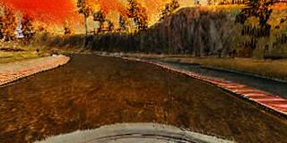 
  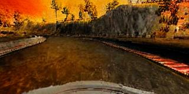
  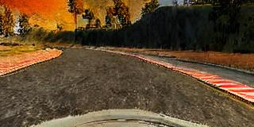 
  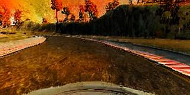
</p>

> **Prompt**: "Change time to night"
<p align="center">
  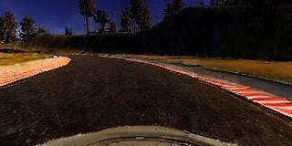
  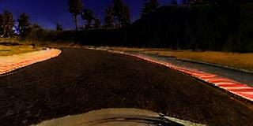 
  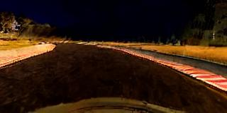
  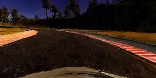 
  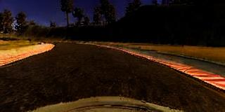
</p>


#### Inpainting
Preserves the road pixels via a mask and regenerates the background with a text prompt.

The augmented dataset (7.7 GB compressed) can be accessed from this [link](https://icse-2025.s3.eu-north-1.amazonaws.com/stable_diffusion_inpainting.tar.xz)

> **Prompt**: "A street in autumn season"
<p align="center">
  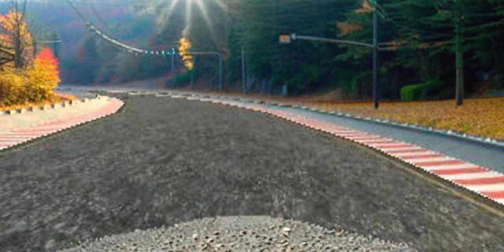
  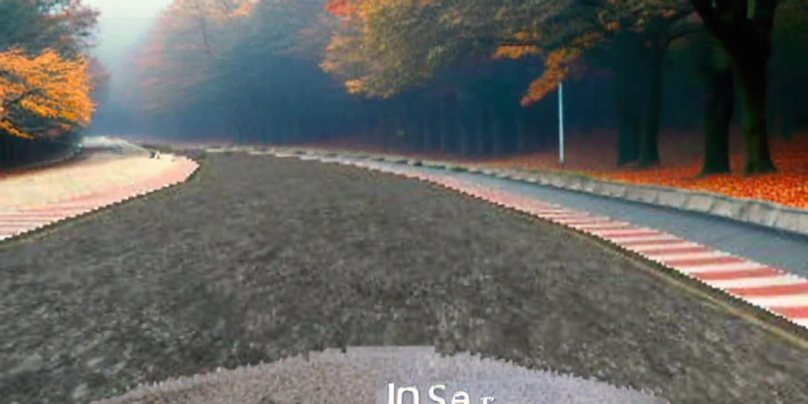
  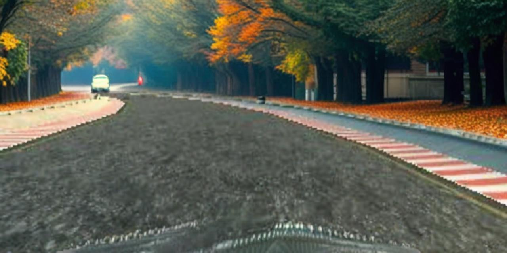
  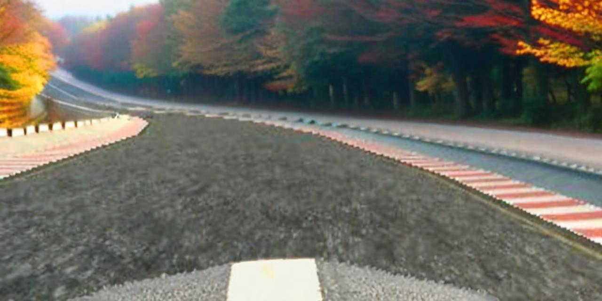
  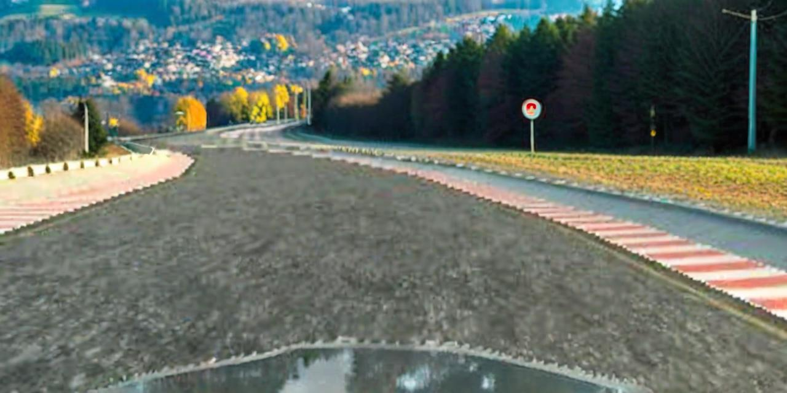
</p>

> **Prompt**: "A street in night time"
<p align="center">
  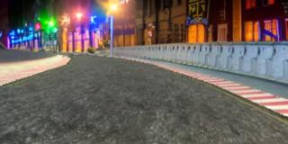
  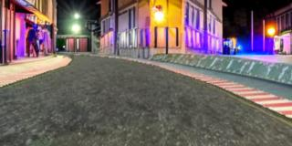
  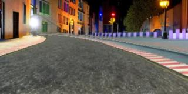
  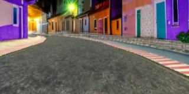
  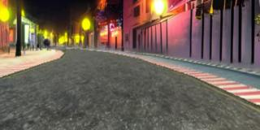
</p>

> **Prompt**: "A street during dust storm"
<p align="center">
  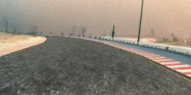
  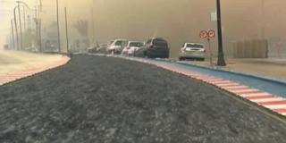
  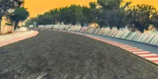
  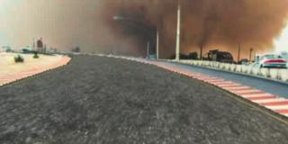
  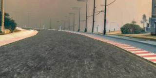
</p>

#### Inpainting with Refinement
An additional refinement step enforces edge coherence for higher realism while retaining road geometry.

The augmented dataset (9.9 GB compressed) can be accessed from this [link](https://icse-2025.s3.eu-north-1.amazonaws.com/stable_diffusion_inpainting_controlnet_refining.tar.xz)

> **Prompt**: "A street in autumn season"
<p align="center">
  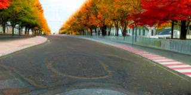
  
  
  
  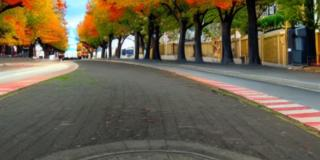
</p>

> **Prompt**: "A street during dust storm"
<p align="center">
  
  
  
  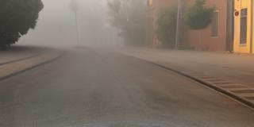
  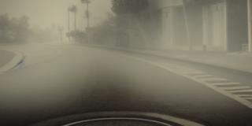
</p>

## Setup

This artifact includes **executable components** (ADS simulations and augmentation scripts) that require a suitable environment. Below is a detailed guide to preparing and running the artifact:

**Hardware Requirements**  
- **GPU**: We strongly recommend an NVIDIA GPU (CUDA-compatible) with at least 16 GB of dedicated video memory. (We tested with NVIDIA 4090 24 GB)
- **CPU & RAM**: A modern multi-core CPU (e.g., 4+ cores) and at least 32 GB of system memory are suggested for efficient training and inference. (We tested with a Ryzen 5950X 32 cores and 64 GB memory)
- **Disk Space**: The datasets can require up to 50 GB when expanded. Verify you have adequate free storage. Pretrained checkpoints take about 100 GB, and the checkpoints of distilled models require at least 50 GB. Overall, we recommend to have at least 200 GB to fully replicate this artifact.

**Software Requirements**  
- **Operating System**: Linux (tested on Ubuntu 24.04), though other UNIX-like systems may work with minor adjustments.  
- **CUDA & Drivers**: For GPU-accelerated tasks, install CUDA (tested with version 12.1) and the corresponding NVIDIA drivers.  
- **Python**: Version 3.8 or higher (tested with Python 3.10).  
- **Dependencies**: Listed in `requirements.txt` (install using `pip install -r requirements.txt`).

> **Docker**: We do not recommend to use this artifact in a Docker environment since it requires NVIDIA Drivers and to redirect the X Server output for rendering driving simulations.

**Quick Verification**  
1. **Clone the Repository**:  
   ```bash
   git clone https://github.com/deib-polimi/online-testing-augmented-simulator
   cd online-testing-augmented-simulator
   ```
2. **Install Python Packages**:  
   ```bash
   python3 -m venv venv
   source venv/bin/activate
   pip install -r requirements.txt
   ```
3. **Check GPU availability**:  
   ```bash
   python -c "import torch; print(torch.cuda.is_available())"
   ```
   If `True`, your system recognizes the GPU successfully.

4. **GPU Configuration**:
   Please choose which GPU device you want to use with from `utils/conf.py`:
   ```Python
   DEFAULT_DEVICE = "cuda:0"        # using device 0
   ```
   
5. **Paths Configuration**:
   Please setup the folder where to **save** the results `utils/path_utils.py`:
   ```Python
   import pathlib
   
   PROJECT_DIR = pathlib.Path(__file__).parent.parent.absolute()
   RESULT_DIR = ...
   MODEL_DIR = ...
   LOG_DIR = ...
   DATASET_DIR = ...
   ```
   
6. **Udacity Simulator**:
   Please download the simulator from this [link](https://icse-2025.s3.eu-north-1.amazonaws.com/udacity-linux.tar.xz), run from terminal:
   ```bash
   wget https://icse-2025.s3.eu-north-1.amazonaws.com/udacity-linux.tar.xz
   tar -xJf pretrained-udacity-models.tar.xz
   ```
   Check if the Udacity simulator is running correctly:
   ```bash
   cd simulatorv2
   ./udacity.x86_64
   ```
   > Ensure that you have an active graphic server (i.e., Xorg).

   > Ensure that you have Vulkan API installed (`sudo apt install libvulkan1`).
   
7. **Pretrained Driving Checkpoints**:
   Move the pretrained checkpoints into your models directory:
   ```bash
   export MODEL_DIR="[INSERT YOUR MODEL DIRECTORY]"
   
   tar -xJf udacity-linux.tar.xz
   
   mkdir $MODEL_DIR/dave2
   mkdir $MODEL_DIR/chauffeur
   mkdir $MODEL_DIR/epoch
   mkdir $MODEL_DIR/vit
   
   mv dave2.ckpt $MODEL_DIR/dave2/
   mv chauffeur.ckpt $MODEL_DIR/chauffeur/
   mv epoch.ckpt $MODEL_DIR/epoch/
   mv vit.ckpt $MODEL_DIR/vit/
   ```
   
7. **Setup PythonPath**:
   ```bash
   export PYTHONPATH="[THIS PROJECT DIRECTORY (online-testing-augmented-simulator)]"
   ```

## Usage

### Udacity Simulator

1. **Nominal Condition**:
   ```bash
   python3 scripts/online/nominal.py
   ```
   
2. **Augmented Condition (diffusion models)**:
   ```bash
   python3 scripts/online/instructpix2pix.py
   python3 scripts/online/stable_diffusion_inpainting.py
   python3 scripts/online/stable_diffusion_inpainting_controlnet_refining.py
   ```
   
   > Each script might require 48+ hours.

   To reduce the duration of the script, reduce the amount of domains to be synthesized.
   For example, for InstructPix2Pix, in `scripts/online/instructpix2pix.py`, edit:
   ```python
    # 6. Drive
    for prompt, model_name in list(itertools.product(
            ALL_INSTRUCTIONS, # -> ["Make it autumn", "Make it summer", ...]
            ['dave2', 'epoch', 'chauffeur', 'vit']
    )):
    ```

3. **Train the distilled models**:

   Before running the script, configure `domain` and `approach` (lines 27-52).
   ```bash
   python3 models/cyclegan/train.py
   ```

   > Note that, to improve monitoring of the checkpoints, we used wandb.

   > It is possible to disable this service by removing the following lines of code (line 97) `wandb_logger = WandbLogger(project=f"cyclegan_{version}", dir=LOG_DIR.joinpath(f"cyclegan_{version}"))` and (line 103) `  logger=[wandb_logger],`.

   > Each script might require 24+ hours.

4. **Distilled and augmented conditions**:

   ```bash
   python3 scripts/online/instructpix2pix.py
   python3 scripts/online/stable_diffusion_inpainting.py
   python3 scripts/online/stable_diffusion_inpainting_controlnet_refining.py
   ```
   
   > Each script might require 24+ hours.

### CARLA Simulator

Experiments with CARLA simulator were executed starting from the [InterFuser repository](https://github.com/opendilab/InterFuser).
Follow their instruction to install CARLA and InterFuser.

1. **Nominal Condition**:
   Run the script from the original authors ([link](https://github.com/opendilab/InterFuser/tree/main?tab=readme-ov-file#evaluation)).
   ```bash
   export CARLA_ROOT=[PATH TO THE CARLA SIMULATOR]
   export ROUTES=leaderboard/data/evaluation_routes/routes_town05_long.xml
   export TEAM_AGENT=leaderboard/team_code/interfuser_agent.py
   export TEAM_CONFIG=leaderboard/team_code/interfuser_config.py
   export CHECKPOINT_ENDPOINT=results/interfuser_result.json
   export SCENARIOS=leaderboard/data/scenarios/town05_all_scenarios.json
   
   CUDA_VISIBLE_DEVICES=0 ./leaderboard/scripts/run_evaluation.sh
   ```
   
2. **Offline Domain Augmentation**:
   ```bash
   python3 carla/instruct.py
   python3 carla/inpainting.py
   python3 carla/refining.py
   ```
   > Each script might require 48+ hours.

3. **Train the distilled models**:

   Before running the script, configure `domain` and `approach` (lines 27-52).
   ```bash
   python3 models/cyclegan/train.py
   ```

   > Note that, to improve monitoring of the checkpoints, we used wandb.

   > It is possible to disable this service by removing the following lines of code (line 97) `wandb_logger = WandbLogger(project=f"cyclegan_{version}", dir=LOG_DIR.joinpath(f"cyclegan_{version}"))` and (line 103) `  logger=[wandb_logger],`.
   
4. **Run the distilled conditions**:
   Replace the original `interfuser_agent.py` script with the one in this project.

   ```bash
   CUDA_VISIBLE_DEVICES=0 ./leaderboard/scripts/run_evaluation.sh
   ```

## LICENSE
All code within this repository is under [MIT LICENSE](https://github.com/deib-polimi/online-testing-augmented-simulator/blob/master/LICENSE) 