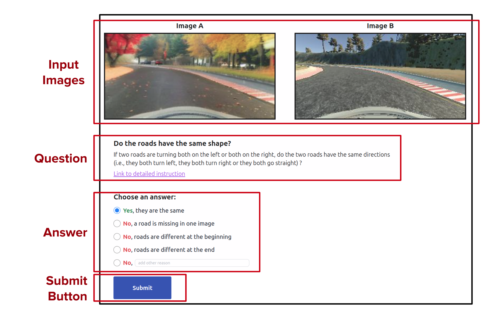

# Results Documentation

This directory contains all the materials and documentation related to the human study conducted for **Autonomous Driving System Testing with Domain Augmentation**.

## Contents

1. [Human Survey Results](#human-survey-results)  
2. [Platform Used for Human Survey](#platform-used-for-human-survey)  
3. [Mechanical Turk Template](#mechanical-turk-template)  
4. [Tutorial for Participants](#tutorial-for-participants)  
5. [Dataset of Images for Human Survey](#dataset-of-images-for-human-survey)
6. [GLM Analysis](#glm-analysis)  

---

## Human Survey Results

The human survey was conducted to evaluate the **realism** and **semantic validity** of the augmented images generated during the experiments.  
The anonymized responses from the survey are available [here](../scripts/human_study/mturk_data.zip).  

**Key Findings**:
- **Semantic Validity**: Participants identified semantically valid images with an accuracy rate of 92% in the validation set.
- **Realism Evaluation**: Responses were collected using a Likert scale. Average realism ratings ranged from 3.5 to 4.7 across augmentation techniques.  

---

## Platform Used for Human Survey

The human survey was deployed using a custom-built **web platform** designed to mirror the interface of Mechanical Turk, ensuring uniformity in evaluation. This platform is a separate project built with **Django**, a robust Python-based web framework.

### Platform Features

- **Task Support**: Participants completed both realism and semantic validity assessments using a streamlined, intuitive interface.
- **Data Management**: The platform saves all collected data locally, ensuring secure and efficient storage of participant responses.
- **Deployment**: It can be hosted on a local server, making it easy to set up and run for small-scale studies or controlled experiments.
- **Consistency**: Ensures uniform task presentation across all participants, minimizing variability in the survey environment.

The source code for the web platform is available [here](../scripts/human_study/human-survey-django-platform.zip).

### Example

Below are two example screenshots from the platform, showcasing a realism question (left) and a semantic validity question (right):

  
  

---

## Mechanical Turk Template

We created a Mechanical Turk template for scaling the survey to a larger participant pool.  
The template contains:
- Survey structure and design.  
- Instructions for participants to complete the task effectively.  

The Mechanical Turk semantic template is provided in `mturk_semantic_template.html` and is accessible [here](mturk_semantic_template.html). While the Mechanical Turk realism template is provided in `mturk_realism_template.html` and is accessible [here](mturk_realism_template.html).

---

## Tutorial for Participants

To ensure participants understood the task, we created a comprehensive **tutorial** explaining how to evaluate image realism and semantic validity.  

The tutorial includes:
1. Definitions and examples of semantic validity and realism.  
2. Step-by-step instructions for answering questions on the survey platform.  
3. Example tasks with feedback for learning purposes.

The semantic validity tutorial can be accessed [here](https://tinyurl.com/icse-2025-semantic-tutorial).
The realism tutorial can be accessed [here](https://tinyurl.com/icse-2025-realism-tutorial).

---

## Dataset of Images for Human Survey

The dataset used for the human survey consists of augmented images generated using the following techniques:
1. **Instruction Editing**  
2. **Inpainting**  
3. **Inpainting with Refinement**

The dataset is available [here](https://tinyurl.com/icse-2025-realism-tutorial).

---

For any additional questions, please refer to the project documentation or contact the authors directly.  

## GLM Analysis

To analyze the relationship between user expertise and survey performance, we conducted a **Generalized Linear Model (GLM)** regression.

**Key Variables**:
- Predictors: Years of driving experience, ADS knowledge, vision quality, and ADS-related experience.  
- Outcome: Performance on the semantic validity task (False Positive Rate, Realism).

**Findings**:
- No statistically significant correlation was observed between any user expertise variables and performance metrics.  
- A detailed summary of the regression analysis is included in [here](../scripts/human_study/009_categorization_semantic.py) (semantic) and [here](../scripts/human_study/010_categorization_realism.py) (realism).

---